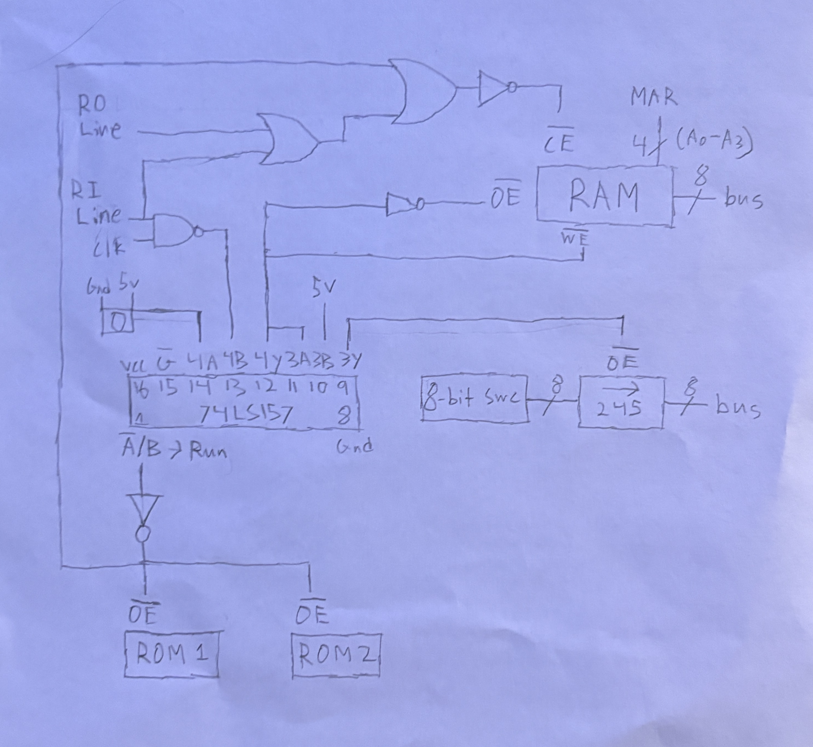

# Breadboard-Cube-Solver

## Project Goal

I wanted to understand computers and Rubik's cubes at a level deeper than just using them. To quote Richard Feynman, "What I cannot create, I do not understand", so to prove to myself that I truly understand the basics of both, let's build a machine (computer) that can solve a Rubik's cube independently. NOTE: This solution, both hardware and software, is likely not the only solution, nor the most efficient, just one that I thought of.

## Hardware Overview

Upon initial research, the easier path seemed to be to build a general purpose, turing complete, breadboard computer. Luckily, Ben Eater has a YouTube series that does exactly this. Completing his build alone will bring you most of the way there. The TTL IC's you use, don't need to be exactly identical. I used some different IC's, but the overall computer funtionality must be equivalent and turing complete. Once the inital build is complete, you probably realize we will need more than the 16 bytes of instruction memory in the original design to run a potential solving algorithm.

## Hardware Implementation

So now we must make some hardware upgrades. Improving the memory chip isn't enough by itself, we also need to expand the memory address to 8 bits from the original 4. This will affect other components and wiring but it's doable. With 8 bits we can now write 128 bytes of instructions. Next, another modification: we reroute the Jump Carry signal from the carry bit of the adder IC to the LSB of the ALU result. This repurposes JC from an overflow check into a parity check: a single wire change that gives us the ability to distinguish odd from even, which turns out to be essential for the solving algorithm. That hardware change came after trying to develop the software. Sometimes you can optimize the hardware to efficiently run the software. We will have to fetch two bytes per instruction now, but we finally have the necessary hardware to run a potential algorithm.

## Software Overview

There are a lot of ways to solve a Rubik's cube but funny enough, the "beginner's" method is rather difficult to implement on a computer as primitive as ours. Our computer is extremely memory constrained, but so are humans. However, humans have eyes and are very robust, so they typically solve a cube by repeating a loop of: assessing the cube, making a move, and reassessing the cube to see which pieces moved. Unfortunately our computer doesn't have eyes so instead we will solve it the way blindfolded humans do.

## Software Implementation

A classic blindsolving method is called Old Pochmann, where you essentially follow a linked list of the unsolved pieces. The computer hardware that we built follows a purely Von Neumann architecture where memory is shared for instructions and data. This isn't great news considering our already limited memory. My solution to bypass it is by writing self-modifying code where the program rewrites its own instructions at runtime to traverse the permutation. Basically we index all the pieces along with their location, and we have a linked list of the unsolved pieces where each wrongly placed piece is in the memory location of the piece which is supposed to be there. We then follow the list until fully solved. All the code is unfortunately written directly to the RAM in machine code by hand, no assembler, no compiler, no abstraction layers.

## RISC-V Port

To explore furthur, I wanted to see if we could create a solution more efficiently both hardware and software wise. As a next step, I ported this same algorithm to run on, a pipelined RISC-V processor deployed on a Basys-3 FPGA with SystemVerilog. With risc-v architecture, we don't have to write self-modifying code. 
Link to that repo: https://github.com/dawsonzhou225/riscv-pipelined-fpga

## Credits

- [Ben Eater](https://www.youtube.com/beneater) — 8-bit breadboard computer series
- [Helpful reddit post for RAM address expansion](https://www.reddit.com/r/beneater/comments/h8y28k/stepbystep_guide_to_upgrading_the_ram_with/) — RAM module upgrade guide